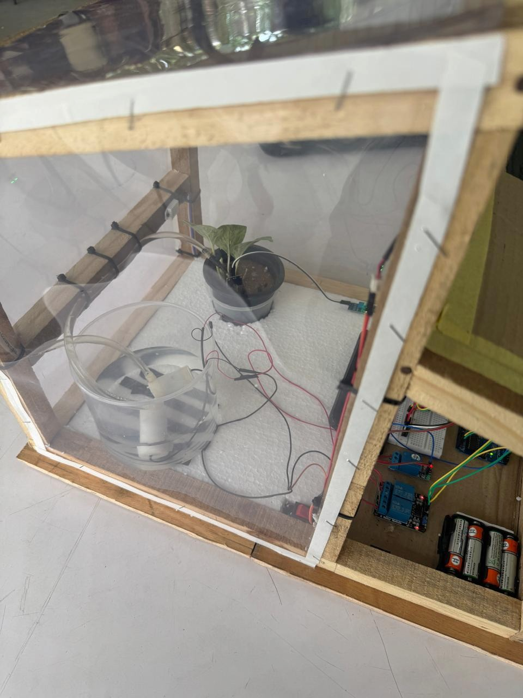
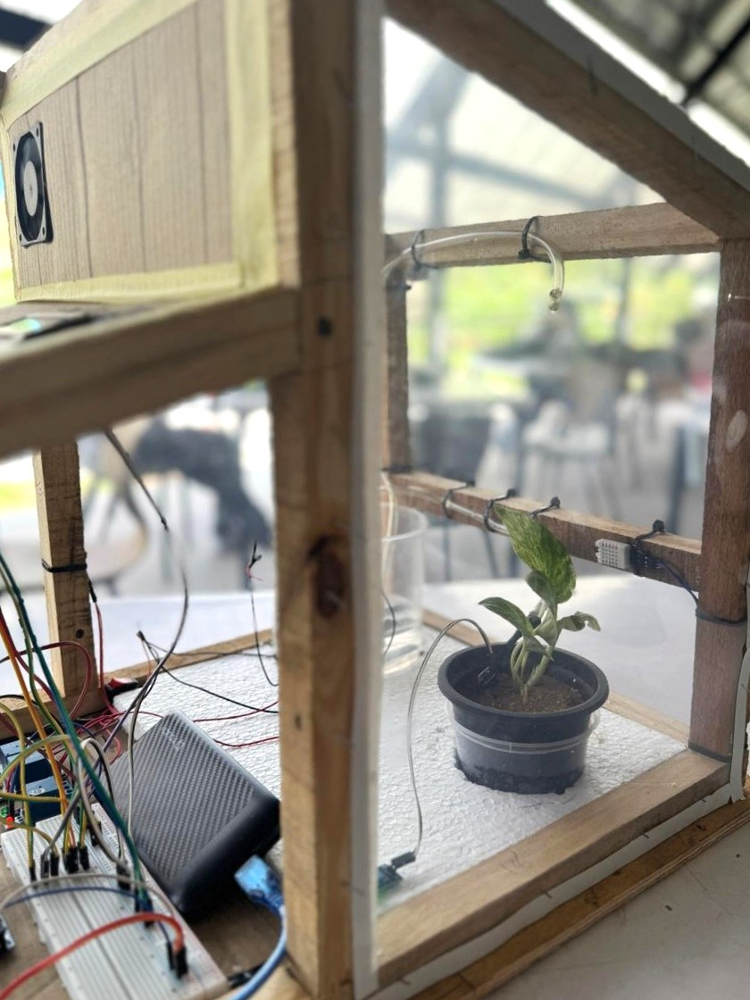
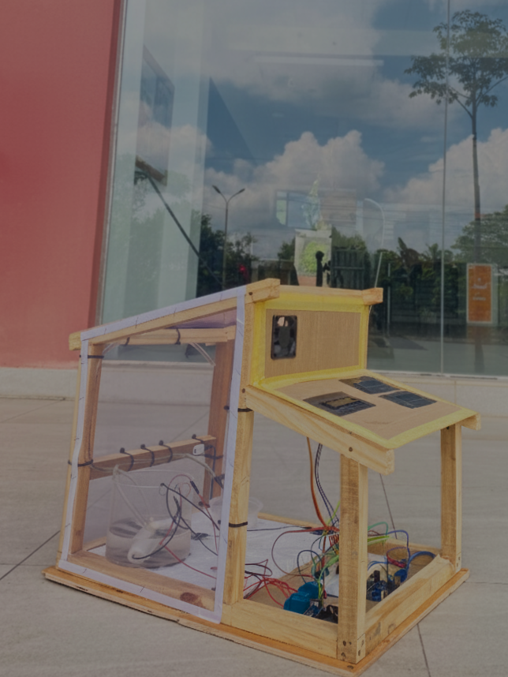

# 🌱 BerryBloom Smart Greenhouse Automation System

An Arduino-based Smart Greenhouse System designed to measure soil moisture, temperature, and humidity using multiple sensors. All sensor readings are displayed in real time on a 16×2 LCD display .

The system automatically controls a water pump, foggers, and an exhaust fan based on sensor values to maintain a healthy environment for plant growth.

> **Note:** This project was completed as our First-Year, First-Semester Final Group Project, focusing on embedded systems, sensor integration, and automation control using Arduino.

---

## 🔧 Features

- ✅ Measures soil moisture, temperature, and humidity
- ✅ Real-time display through a 16×2 LCD
- ✅ Automatic control of:
  - 🌧️ Water Pump
  - 💨 Exhaust Fan
  - 💦 Foggers
- ✅ Fully offline system
- ✅ Simple, low-cost, and expandable

---

## 🧰 Components Used

| Component | Quantity | Purpose |
|-----------|----------|---------|
| Arduino Uno | 1 | Main controller |
| Soil Moisture Sensor | 1 | Reads soil wetness level |
| DHT11/DHT22 Sensor | 1 | Measures temperature & humidity |
| 16×2 LCD Display (I2C) | 1 | Shows real-time readings |
| Relay Module | 3 | Controls pump, fan, and foggers |
| Water Pump | 2 | Automated irrigation |
| Foggers | 1 or more | Humidity control |
| Exhaust Fan | 1 | Ventilation |
| Jumper Wires & Breadboard | — | Circuit connections |

---
## 📚 Required Libraries

This project uses the following Arduino libraries:

| Library | Version | Purpose | Installation |
|---------|---------|---------|-------------|
| **DHT sensor library** | Latest | Read temperature and humidity from DHT22 sensor | Search "DHT sensor library" by Adafruit in Library Manager |
| **LiquidCrystal_I2C** | Latest | Control multiple I2C LCD displays | Search "LiquidCrystal I2C" by Frank de Brabander in Library Manager |
| **Wire** | Built-in | I2C communication protocol | Pre-installed with Arduino IDE |

### Library Documentation

- **DHT Sensor Library**: [GitHub - Adafruit DHT](https://github.com/adafruit/DHT-sensor-library)
- **LiquidCrystal I2C**: [GitHub - LiquidCrystal_I2C](https://github.com/johnrickman/LiquidCrystal_I2C)
---

## ⚙️ How the System Works

1. **Sensors** measure soil moisture, temperature, and humidity.
2. **Values** are processed by the Arduino.
3. **LCD** displays real-time environmental readings.
4. **If values exceed set thresholds:**
   - Water pump activates for dry soil
   - Foggers activate for low humidity
   - Exhaust fan activates for high temperature
5. **System loops** continuously, updating every second.

---

## 📚 Documentation

For detailed project documentation, circuit diagrams, component datasheets, and additional resources, visit our comprehensive documentation:

📄 **[View Full Documentation on Google Drive](https://drive.google.com/your-documentation-link-here)**

---

| System Architecture | System Architecture Diagram |
|:-------------------:|:---------------------------:|
|  |  |

---

## 📸 Final Output

<div align="center">

| | | | |
|:---:|:---:|:---:|:---:|
|  |  |  |  |

</div>

---

## ⚡ Threshold Configuration

You can customize the automation thresholds by modifying these values in the code:

```cpp
// Soil Moisture Threshold (adjust based on your sensor)
int soilThreshold = 500;  // Lower value = wetter soil

// Temperature Threshold (°C)
int tempThreshold = 30;

// Humidity Threshold (%)
int humidityThreshold = 60;
```

---

## 🤝 Contributing

Contributions are welcome! Feel free to:
- Report bugs
- Suggest new features
- Submit pull requests

---

## 👥 Team Members

- A.D Rajasinghe
- P. Pratheep
- D.N.S Samarawickrama 
- A.M.P.L Bandara
- L.S.N Perera
- M.J.M Jahaas
  
---

## 🧾 License

This project is open-source under the [MIT License](LICENSE). You are free to use, modify, and distribute with proper credit.

---

## 📧 Contact

For questions or suggestions, feel free to reach out:

- GitHub: [@pathumzcode](https://github.com/pathumzcode)
- Email: pathumlakshanbandara@outlook.com

---

## 🙏 Acknowledgments

- Thanks to our instructors for guidance throughout this project
- Arduino community for documentation and support
- All open-source library contributors

---

<div align="center">

📌 **Check out our LinkedIn post about this project:**

[](https://www.linkedin.com/posts/your-post-link-here)

</div>

---

<div align="center">

⭐ **If you found this project helpful, please give it a star!** ⭐

</div>
